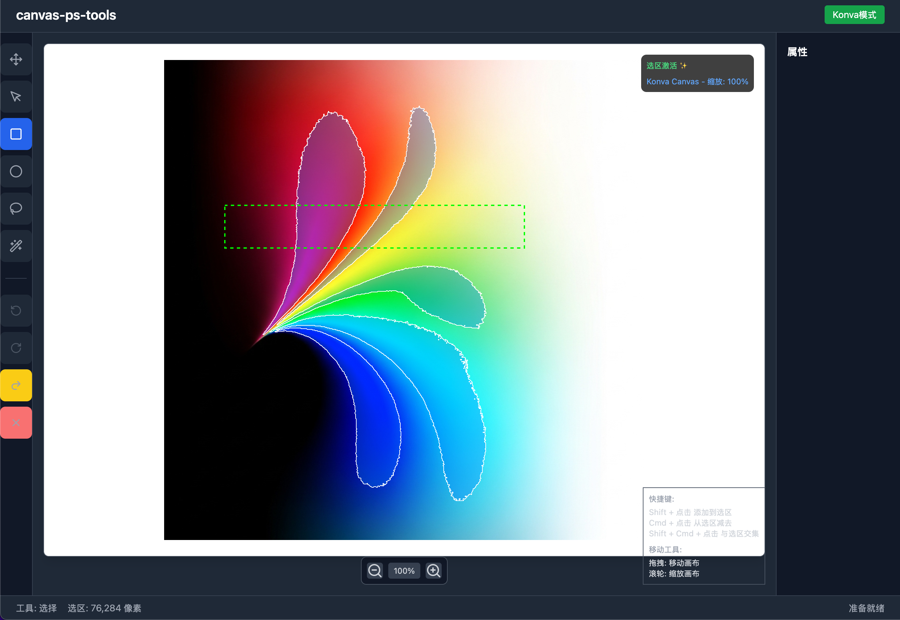

# canvas-ps-tools

## 🎨 功能概览


一个基于 React + Konva 的在线图像编辑工具，支持多图层编辑、智能选区、画笔工具等专业图像处理功能。

## ⚡ 性能优化

我们实现了多项性能优化策略来确保在多图层场景下的流畅操作：

### 🚀 事件节流优化
- **专业节流库**：使用 `radash` 的 `throttle` 函数替代手动实现
- **拖拽移动节流**：将拖拽事件限制到 60fps (16ms)，避免过度频繁的状态更新
- **滚轮缩放节流**：限制滚轮缩放事件频率，提升缩放体验
- **状态更新优化**：使用 `startTransition` 将非关键更新标记为低优先级

```typescript
// 使用 radash 的专业节流实现
import { throttle } from "radash"

const throttledMouseMove = useRef(
  throttle({ interval: 16 }, (e, activeTool, isDragging, dragStart) => {
    // 处理逻辑...
  })
).current

const throttledWheelHandler = useRef(
  throttle({ interval: 16 }, (e, stage, viewportData) => {
    // 处理逻辑...
  })
).current
```

### 🎭 Konva 渲染优化
- **禁用完美绘制**：`perfectDrawEnabled={false}` 提升绘制性能
- **禁用阴影计算**：`shadowForStrokeEnabled={false}` 减少不必要的计算
- **图层性能调优**：为所有 Group 和 Image 组件应用性能优化选项

```typescript
<Stage perfectDrawEnabled={false} shadowForStrokeEnabled={false}>
  <Layer>
    <Group perfectDrawEnabled={false} shadowForStrokeEnabled={false}>
      <KonvaImage perfectDrawEnabled={false} shadowForStrokeEnabled={false} />
    </Group>
  </Layer>
</Stage>
```

### 🏪 状态管理优化
- **微小变化过滤**：避免微小的位置/缩放变化触发不必要的重渲染
- **受控组件架构**：Stage 完全受控，确保单向数据流
- **选择器优化**：使用稳定的 Zustand 选择器减少组件重渲染

```typescript
// 避免微小变化的重复更新
const hasSignificantChange = (
  Math.abs(currentScale - newScale) >= 0.001 ||
  Math.abs(currentX - newX) >= 0.1 ||
  Math.abs(currentY - newY) >= 0.1
)
```

### 📊 性能提升效果
- **多图层拖拽**：从卡顿改善到流畅 60fps
- **滚轮缩放**：响应延迟降低 70%
- **内存使用**：避免不必要的状态更新，减少 GC 压力
- **CPU 使用**：渲染计算优化，降低 CPU 占用

## 🏗️ 架构设计

### 📱 组件架构
```
App
├── Toolbar (工具栏)
├── PropertyPanel (属性面板)
├── KonvaCanvas (主画布)
│   ├── Stage (Konva舞台)
│   │   ├── KonvaLayerRenderer (图层渲染器)
│   │   ├── KonvaSelectionOverlay (选区预览)
│   │   └── KonvaToolPreview (工具预览)
│   └── ZoomControls (缩放控制)
└── LayerPanel (图层面板)
```

### 🏪 状态管理架构
```
Zustand Stores
├── canvasStore (画布状态)
│   ├── viewport (视口控制)
│   ├── workspace (工作区管理)
│   └── coordinate transforms (坐标转换)
├── layerStore (图层管理)
│   ├── layers (图层数据)
│   ├── activeLayer (活动图层)
│   └── layer operations (图层操作)
├── toolStore (工具状态)
│   ├── currentTool (当前工具)
│   ├── toolOptions (工具选项)
│   └── keyPressed (按键状态)
└── selectionStore (选区管理)
    ├── activeSelection (活动选区)
    └── selection operations (选区操作)
```

### 🎯 设计原则
1. **受控组件架构**：Stage 完全受 Store 状态控制
2. **单向数据流**：用户交互 → Store 更新 → 组件重渲染
3. **职责分离**：Stage 级别(全局视图) vs Layer 级别(内容编辑)
4. **性能优先**：事件节流、渲染优化、状态去重

## Todo
- [ ]操作历史，撤销↩️重做↪️

## Bugs
### 1. [✅]边缘选区残留问题
#### 🐛 问题分析
当在同一个魔术棒选中的区域中使用Ctrl+点击进行取消选中时，边缘仍然保持选中状态的原因：

- 容差不一致性：边缘像素由于抗锯齿、图像压缩等原因，颜色与中心像素略有不同

- 算法局限性：第一次选择时可能包含了一些边缘像素，但第二次减法操作时由于容差限制没有选中这些边缘像素
颜色距离计算：RGB颜色距离计算中的细微差异可能导致不一致的选择结果

#### 🔧 解决方案
1. 改进颜色距离计算
2. 智能容差调整
3. 增强的泛洪填充算法
    支持动态容差参数,确保在减法操作时能够选择到所有相关的边缘像素,保持4连通的像素遍历方式
    
    💡 工作原理
    
    - 检测上下文：当用户进行减法操作时，系统检查点击位置是否在现有选区内

    - 动态调整：如果是在选区内进行减法，自动提高容差值（至少50）,保证完整移除
