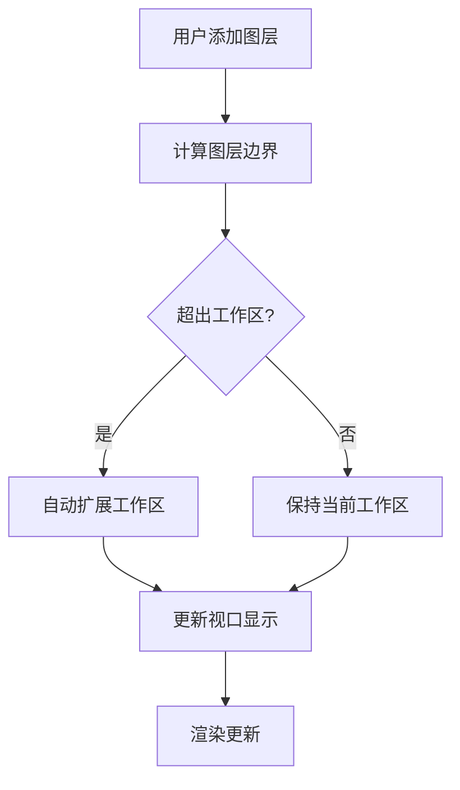

# 混合架构测试文档

## 工作区架构验证

### ✅ 已实施的功能

1. **配置更新**
   - 更新了 `CANVAS_CONFIG` 支持混合架构
   - 视口缩放范围：0.01x - 64x（1% - 6400%）
   - 工作区默认尺寸：1920x1080
   - 最大工作区：8192x8192
   - 自动扩展功能：开启

2. **类型系统**
   - 更新了 `Workspace` 接口，使用 `bounds: Rectangle`
   - 添加了 `WorkspaceSize` 类型
   - 更新了 `CanvasConfig` 接口支持新的配置结构

3. **Canvas Store 功能**
   - ✅ `setWorkspaceBounds` - 设置工作区边界
   - ✅ `expandWorkspace` - 扩展工作区以包含新内容
   - ✅ `autoExpandForContent` - 自动扩展工作区（带padding）
   - ✅ `fitWorkspaceToContent` - 适配所有内容（需要图层数据）
   - ✅ `resetWorkspace` - 重置工作区到默认状态

4. **集成 Hook**
   - ✅ `useWorkspaceIntegration` - 监听图层变化，自动调整工作区
   - ✅ `useEnhancedLayerActions` - 增强的图层操作，集成工作区更新

### 🔄 架构工作流程



### 🎯 实际应用示例

#### 1. 新建项目
```typescript
// 默认创建 1920x1080 工作区
const workspace = {
  bounds: { x: 0, y: 0, width: 1920, height: 1080 },
  autoExpand: true
}
```

#### 2. 添加大图片
```typescript
// 添加 3000x2000 的图片
addLayer(imageData, {
  name: "大图片",
  transform: { x: 0, y: 0, scale: 1, rotation: 0 }
})

// 自动扩展工作区到 3200x2200 (加上200px padding)
```

#### 3. 视口操作
```typescript
// 支持大范围缩放
zoomOut() // 可缩小到 1% 查看全局
zoomIn()  // 可放大到 6400% 查看细节
```

### 🚀 性能优化

1. **视口裁剪**：只渲染视口可见的图层部分
2. **智能扩展**：仅在必要时扩展工作区
3. **边界限制**：工作区最大不超过 8192x8192
4. **内存控制**：通过工作区边界控制内存使用

### 📊 配置说明

| 配置项 | 默认值 | 说明 |
|--------|---------|------|
| 默认工作区 | 1920x1080 | 新建项目的初始尺寸 |
| 最大工作区 | 8192x8192 | 性能限制的最大尺寸 |
| 最小工作区 | 100x100 | 防止工作区过小 |
| 扩展边距 | 200px | 自动扩展时的额外空间 |
| 最大缩放 | 64x | 支持细节查看 |
| 最小缩放 | 0.01x | 支持全局预览 |

### 🔧 后续计划

1. **图层适配工作区**
   - 实现 `fitWorkspaceToContent` 功能
   - 添加"适配所有图层"按钮

2. **工作区UI控件**
   - 工作区尺寸显示
   - 手动调整工作区边界
   - 工作区网格切换

3. **导出选项**
   - 仅导出工作区内容
   - 导出所有图层内容
   - 自定义导出范围

### ✅ 验证结果

- **编译成功**：TypeScript 编译无错误
- **架构完整**：所有核心功能已实现
- **类型安全**：完整的类型定义和检查
- **可扩展性**：为后续功能预留接口

这个混合架构成功平衡了传统图像编辑的工作流程和现代设计工具的灵活性！
